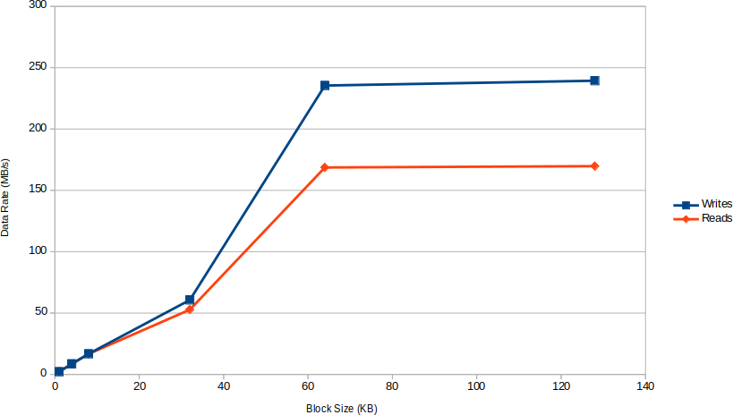

### FTDI FT601 SuperSpeed USB3.0 to AXI bus master

Github:   [https://github.com/ultraembedded/core_ft60x_axi](https://github.com/ultraembedded/core_ft60x_axi)

This component allows an FTDI FT601 USB3.0 device to act as a high-performance AXI4 bus master.

##### Features
* Interfaces to FTDI FT601 USB FIFO device.
* AXI-4 bus master with support for incrementing bursts and multiple outstanding transactions (for high performance).
* 2 x 8KB FIFO (which map to BlockRAMs in Xilinx FPGAs).
* Designed to work @ 100MHz in FPGA (as per FTDI FT60x max clock rate).
* Uses FT60x 245 mode protocol (32-bit mode).
* Support for 32 GPIO.
* Capable of sustained pipelined AXI-4 burst **reads @ 170MB/s** and **writes @ 230MB/s**.

##### Performance

##### Testing
Verified under simulation (constrained random testing), and tested on a Xilinx Artix 7 with blockRAM and DDR3 targets on the LambdaConcept USB2Sniffer Board (connected to a Linux host PC).

Test setup;
* [LambdaConcept USB2Sniffer Board](https://shop.lambdaconcept.com/home/35-usb2-sniffer.html)
* Linux Distro: Linux Mint 19 Tara
* Linux Kernel 5.4.0-050400rc5
* Intel Corporation JHL7540 Thunderbolt 3 USB Controller [Titan Ridge 4C 2018]

Uses the FTDI D3XX drivers which are available for Linux, OS-X, and Windows (although this has only been tested under Linux currently).

##### References
* [FT601 USB3.0 to FIFO Bridge](https://www.ftdichip.com/Support/Documents/DataSheets/ICs/DS_FT600Q-FT601Q%20IC%20Datasheet.pdf)
* [FTDI D3XX Drivers](https://www.ftdichip.com/Drivers/D3XX.htm)
